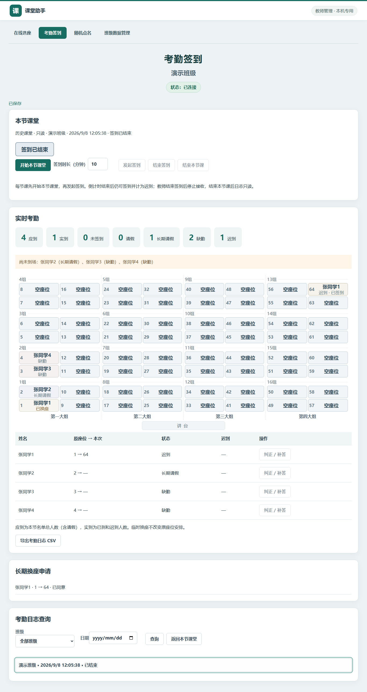
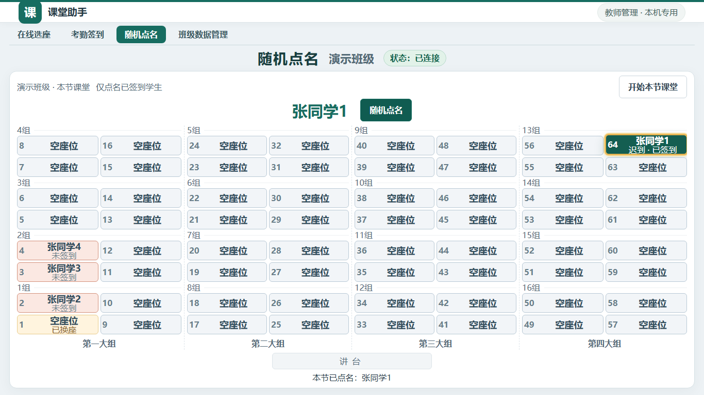
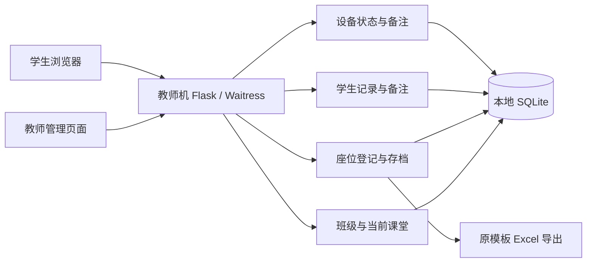

# 课堂助手 · Classroom Assistant

**面向计算机教室的局域网课堂辅助工具：教师机启动服务，学生用浏览器登记座位，结果按原 Excel 模板导出。**

项目从“替代打印座位表、逐个手写姓名”这一真实课堂需求出发，以班级、学生和座位安排为基础，逐步建设可维护的课堂辅助工具。当前已支持在线选座、考勤签到、随机点名和班级数据管理；AI 对话采集、噪声提示与互动挑战待开发。

**当前版本：1.4.0 · 阶段：机房测试 · 教师端：Windows 10/11 x64 · 部署：本地局域网**

[下载与版本发布](https://github.com/chuiyukong/classroom-assistant/releases) · [版本记录](CHANGELOG.md) · [路线图](docs/ROADMAP.md) · [维护手册](docs/MAINTENANCE.md) · [开发状态](docs/PROJECT_STATUS.md)

## 为什么做这个工具

在计算机教室中，学生坐在不同电脑前，教师需要快速得到“谁坐在哪个位置”的准确记录。纸质登记费时，多人直接编辑共享表格又容易出现覆盖、重复和格式变化。

课堂助手让所有学生同时提交自己的座位与姓名，由教师机统一校验并保存。学生能看到当前座位情况，教师可以现场纠错、管理损坏设备，并得到与原来打印表一致的电子表格。它可以配合极域统一打开网页，学生机不需要安装新客户端，也不需要注册账号或连接外网。

新版流程见 [完整功能与流程](docs/全部功能与流程.md)。AI 对话采集见 [下一阶段方案](docs/AI课堂对话采集方案.md)。

## 已实现的功能

| 功能 | 当前行为 |
|---|---|
| 可视化座位登记 | 按现有 64 座、四个大组、十六个小组展示；约每秒更新登记状态 |
| 并发防覆盖 | 同时提交同一座位只接受一条，其他请求明确提示冲突 |
| 防重复登记 | 同一次登记按来源 IP 与浏览器会话限制；换浏览器不能再次占座 |
| 同名处理 | 学生端同名引导到教师端，教师可为同名学生建立独立记录 |
| 当前座位与存档 | 发起新登记后旧安排自动存档；历史只读，支持单独导出 |
| 当前上课班级 | 教师明确指定学生页面显示哪个班；重启服务后仍保留 |
| 设备配置 | 停用损坏座位、记录设备问题，所有班级共用 |
| 学生备注 | 学生特殊情况绑定独立学生记录，换座或重新登记不丢失；仅教师可见 |
| 原模板导出 | 填写姓名、班级及登记人数，保留原 Excel 布局和打印设置 |
| 考勤签到 | 座位图输入姓名、倒计时、临时换座、长期申请审批、请假迟到与 CSV 日志 |
| 随机点名 | 座位/签到名单自动选择、姓名动画、保存抽取结果 |
| 班级回收站 | 单个/批量删除与恢复，保留设备和历史 |
| 本地持久化 | 数据存入教师机 SQLite，程序更新与课堂数据分开 |

IP 限制针对**本次登记**，不是十分钟冷却。同一班发起新登记或下一班开始登记后，同一电脑可立即使用。IP 是设备线索，不代表学生身份；直接局域网推荐开启，共享代理出口需按实际情况调整。

## 界面预览

以下均为 1.4.0 虚构演示数据。





### 教师管理


### 学生考勤入口


## 快速开始

1. 在 [Releases](https://github.com/chuiyukong/classroom-assistant/releases) 下载 `ClassroomAssistant-v1.4.0-Win10-x64.zip` 并解压。
2. 在教师机双击 `ClassroomAssistant.exe`，保持启动窗口运行。
3. 添加或选择班级。已有安排可点击“设为当前上课班级”供学生查看；重新填写则点击“发起新登记”。
4. 复制启动窗口的学生网址，先在一台学生机测试，再通过极域统一打开。
5. 学生核对实际座位号、输入姓名并提交；教师可点击座位修改姓名、添加备注或配置设备。
6. 完成后点击“结束登记”，再“导出 Excel”。
7. 每节课进入“考勤签到”或“随机点名”，点“开始本节课堂”；需要考勤时再点“发起签到”。

学生未开放登记时自动进入考勤页，选座入口仅在教师开放时出现。

教师机无需另装 Python 或 Office，学生机只需浏览器。学生网址应使用教师机局域网 IP；`localhost` / `127.0.0.1` 是教师本机地址，不能发给学生机。防火墙与网络配置见[使用说明](docs/使用说明.html)和[维护手册](docs/MAINTENANCE.md)。

## 工作方式与技术架构



采用**模块化单体应用**，单程序、单数据库，功能按模块分离。前端使用本地 HTML/CSS、ES5 JavaScript 和 XMLHttpRequest；服务端通过事务与唯一约束处理并发；PyInstaller 打包教师机程序。

后续功能通过统一的 `get_current_arrangement()` 读取当前班级与名单，分别保存自己的事件和结果，不通过 Excel 交换数据，也不直接修改座位模块内部数据。

```text
classroom/
  core/       配置、数据库、迁移、错误处理
  classes/    班级
  layouts/    教室布局、设备配置
  students/   学生身份、私密备注
  seating/    当前座位、登记、存档
  attendance/ 课堂、签到、长期请假和考勤日志
  rollcall/   随机点名与结果
  exports/    Excel 模板导出
  web/        HTTP 接口、教师与学生页面
resources/    默认布局、模板映射、原始表格
tests/        后端与迁移测试
scripts/      浏览器验证、打包与 EXE 验证
docs/         使用、维护、路线图与交接材料
```

详细接口与数据边界见[开发说明](docs/开发说明.md)。

## 版本进展

| 版本 | 日期 | 主要进展 |
|---|---|---|
| 1.4.0 | 2026-09-08 | 原装模板升级修复、座位图签到、倒计时、长期换座审批、点名高亮 |
| 1.2.0 | 2026-09-07 | 新界面、新模板、考勤签到、随机点名、班级回收站 |
| 1.1.0 | 2026-09-06 | IP 防重复、同名处理、当前座位与存档、设备配置、学生备注、项目交接文档 |
| 1.0.0 | 2026-09-06 | 首次实现 64 座登记、班级历史、教师纠错、Excel 导出与便携程序 |

完整修复与迁移说明见 [CHANGELOG](CHANGELOG.md)。本仓库从 1.1.0 的完整源码开始建立 Git 历史；1.0.0 的演进记录保留在变更文档中，不将新版源码冒充旧版标签。

## 后续路线图

以下内容**尚未实现**，按课堂价值与依赖逐步推进，具体顺序可在机房验证后调整。

| 方向 | 计划内容 |
|---|---|
| 稳定性与身份基础 | Win7/极域现场验收、班级名单与学号、受控设备绑定 |
| 点名完善 | 小组筛选、不重复抽取、公平轮换与历史检索界面 |
| 考勤完善 | 批量纠正、审计链、学期汇总与学号名册 |
| AI 对话采集（优先） | 教师 API 代理、队列、增量显示、费用限制与教学对话统计 |
| 噪声提示 | 教师机麦克风电平、阈值与持续时间、声音/界面提醒；默认不保存录音 |
| 互动挑战 | 算法迷宫、二进制解码、找 Bug、逻辑推理、小组协作等短时活动 |
| 其他课堂辅助 | 求助队列、课堂计时、一题快答、离堂反馈、设备报修、任务进度 |

设计建议、依赖和验收场景见[完整路线图](docs/ROADMAP.md)。考勤不会清空座位安排，学生备注也不会自动被解释为请假或免签到。

## 验证与适用边界

- 1.4.0 已通过 **55 项后端测试**，覆盖选座、签到并发与换座、点名来源、长期请假、权限、回收站和模板升级。
- Chromium 浏览器交互、64 个 HTTP 客户端并发及独立 EXE 验证通过。独立来源 IP 在开发测试中模拟，不能替代真实机房验证。
- Excel 的 64 座映射、格式、合并单元格与打印设置已做回归验证；初版使用本机 Excel 检查过打印布局。
- 用户已反馈旧版机房连接正常；**新版考勤/点名、Win7 浏览器和新模板实际打印仍需现场复测。**
- 当前只支持一个固定 64 座布局；尚无正式学号名册或跨班级学生关联；未实现麦克风采集。

完整证据和待验证项见[验收记录](docs/验收记录.md)。

## 数据与升级

主数据库默认位于 `%LOCALAPPDATA%\ClassroomAssistant\classroom.sqlite3`。启动窗口可打开数据目录，也可用 `--data-dir` 或 `CLASSROOM_DATA_DIR` 指定其他位置。学生与设备备注、当前班级和历史登记均保存在本机；常规 Excel 不导出私密备注。

当前项目处于测试阶段：1.1.0 针对目标 schema 2 的旧测试库升级跳过自动备份，后续版本保留常规升级备份机制。已有数据的迁移策略与 IP 限制配置请先看[维护手册](docs/MAINTENANCE.md)。

## 开发与维护

Python 3.11，建议在 Windows 上开发和打包：

```powershell
git clone https://github.com/chuiyukong/classroom-assistant.git
cd classroom-assistant
python -m venv .venv
.\.venv\Scripts\python.exe -m pip install -r requirements-dev.txt
.\.venv\Scripts\python.exe launcher.py --data-dir .\data
```

验证与构建：

```powershell
.\.venv\Scripts\python.exe -m pytest -q
.\.venv\Scripts\python.exe -m playwright install chromium
.\.venv\Scripts\python.exe scripts\check_browser.py
.\.venv\Scripts\python.exe scripts\check_modules_browser.py
powershell -ExecutionPolicy Bypass -File scripts\build.ps1
.\.venv\Scripts\python.exe scripts\check_package.py
```

构建输出在 `dist/v1.4.0/`。课堂数据库、会话密钥、虚拟环境和本地测试产物不进入仓库；便携程序通过 Release 下载。

| 文档 | 用途 |
|---|---|
| [AGENTS.md](AGENTS.md) | 更换 AI、账号或开发者后的接手入口 |
| [项目状态](docs/PROJECT_STATUS.md) | 已完成能力、产品决定、已知限制 |
| [维护手册](docs/MAINTENANCE.md) | 数据、升级、调试、打包与交接 |
| [开发说明](docs/开发说明.md) | 模块、接口、身份与存档规则 |
| [版本记录](CHANGELOG.md) | 已完成变更 |
| [路线图](docs/ROADMAP.md) | 尚未实施的计划 |

发现问题时请记录版本号、复现步骤、教师/学生浏览器版本和预期结果。界面截图与日志应使用演示数据或去除真实学生信息。


## 全部功能与流程图（每次发布更新）


[全部功能与流程说明](docs/全部功能与流程.md) · [逐项功能测试指南](docs/功能测试指南.md)

签到截止时间到后**仍可签到，自动记迟到**，直到教师点击“结束签到”；“开始本节课堂”由考勤与点名共用，一节课只操作一次。


| 功能 | 使用方式与实际规则 |
|---|---|
| 班级与学期 | 新建时年份、上/下学期独立保存，不拼入真实班级名；不同学期可建同名班，同行为独立数据。旧班显示未设置学期，不自动猜测，也暂无补录入口。 |
| 当前上课班级 | 只有设为当前或发起登记才切换学生页面；教师查看别班或存档不会切换。在线选座显示年份学期，其余课堂页只显示班级名。 |
| 班级数据筛选 | 数据管理按年份、学期筛选；可单选、全选当前筛选结果，批量移入回收站或恢复。 |
| 回收站 | 删除会关闭相关登记/课堂并保留历史，设备配置保留。恢复后重新选择上课班级，不自动开放登记。暂不支持永久销毁。 |
| 64 座布局 | 四大组、十六小组，与新版 Excel 对应；讲台方向固定。选座、签到、随机点名使用同一布局。 |
| 登记开放状态 | 深绿色状态块表示开放，灰色表示未开放；连接状态为独立提示，已连接不等于允许提交。 |
| 座位冲突 | 多人同抢一个座位，只接受一个，不覆盖姓名。学生提交须收到教师机成功响应才显示成功。 |
| IP 限制 | 同次登记同来源 IP 和浏览器会话只能登记一次，切换浏览器仍受 IP 限制。没有十分钟过期；新登记重新计数。教师清除会释放占用。IP 不是身份，不能阻止改 IP 或代填姓名。 |
| 重试保护 | 同一提交重试不新增；已由教师清除的旧请求不会让误填记录复活。 |
| 同名处理 | 学生端规范化空白、全半角和大小写后同名拒绝，引导教师。教师通过独立学生记录处理同名，姓名不是编号。签到同名也由教师补签。 |
| 教师纠错 | 当前座位可改姓名、选已有学生、建立同名新学生、清除误填；学生不能自行改已登记内容。 |
| 学生备注 | 私密，绑定学生编号，随学生保留；未就座学生也能建备注。存档冻结备注快照。普通 Excel 和学生页面不含备注。 |
| 座位备注 | 记录设备故障，跨班级共用；仅教师可见。设备停用禁止学生登记/签到，恢复后可选。已有固定姓名保留。 |
| 当前座位/存档 | 新登记立即成为空的当前座位，不继承旧姓名；旧表只读，保留导出。后续课堂模块通过业务接口读取当前座位。 |
| Excel 导出 | 在模板副本填姓名、班级、人数，空座留空；保留其他工作表与打印设置，不覆盖原文件。 |
| 学生入口 | 未开放座位登记时默认签到页并隐藏选座导航；没有发起签到时也能看固定座位。 |
| 本节名单 | 开始课堂时冻结固定座位中已登记学生；不接受名单外姓名，之后改固定座位不改写历史快照。 |
| 签到限制 | 每节课每个学生、来源 IP、会话、实际座位各只能签到一次；重复原提交保留首次时间。教师纠正可以释放占用。 |
| 时限与迟到 | 服务端截止时间为准，截止时刻起记录迟到，迟到秒数从截止时间算起。倒计时到零不关闭；只有教师结束签到/结束课堂才停止。旧版本已关闭签到不会自动重开。 |
| 实时座位签到 | 固定座位姓名加签到状态；实际到场座位显示签到人，原位显示已换座；私密请假原因不向学生公开。输入框不随刷新重建。 |
| 临时换座 | 可选未被本次签到占用且设备可用的座位，输入名单内姓名，选原设备故障或申请长期换座；普通临时换座不改固定座位。 |
| 长期换座审批 | 教师同意后修改当前固定座位，学生身份和备注保留。目标已有固定学生或原位已变化时拒绝覆盖；先由教师核对调整。拒绝申请不撤销本次临时签到。 |
| 考勤状态 | 正常、迟到、未签到、请假、缺勤、长期请假。应到包含请假，实到包含正常和迟到。未开展考勤不自动认定缺勤。 |
| 长期请假 | 教师标记一次，后续课堂沿用；该学生再次成功签到自动解除。自由备注中写长期请假不会自动改变考勤。 |
| 考勤纠正 | 签到关闭后仍可补签/改状态，结束课堂后只读；补签按当前服务端时间算迟到，暂无任意补录到达时间。 |
| 日志查询 | 教师按班级、日期查询课堂快照与最终状态，导出 UTF-8 CSV（Excel/WPS 可打开）。暂无完整逐次纠正审计链。 |
| 随机点名 | 未发起签到使用本节固定名单；发起签到后仅抽到场学生。未签到座位浅红提示；姓名动画结束高亮实际座位。每次独立随机，可能重复，结果持久保存。 |
| 历史点名 | 同节页面展示点名记录；接口支持按课堂读取，独立历史检索页面待开发。 |
| 断线与重启 | 断线显示红色状态、禁止误提交；恢复后同步。教师机重启保留班级、座位和本节签到，但跨天须开始新课堂。 |
| 权限与本地数据 | 教师接口限本机访问，写操作验证会话和来源；数据在独立 SQLite 目录，升级自动备份。学生无需安装，无外部网页资源。 |


每次版本发布同时更新本表、流程图、测试指南和版本记录。介绍项目时请区分已实现与路线图；仓库及下载仍保持私有。
