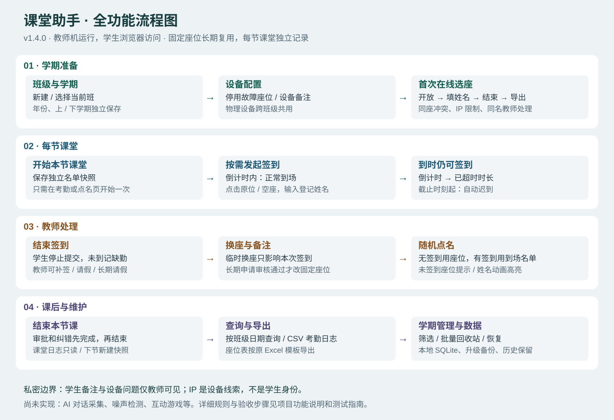
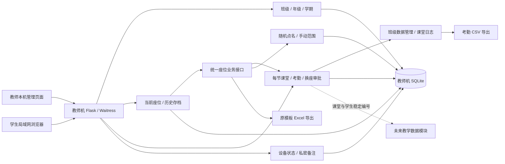
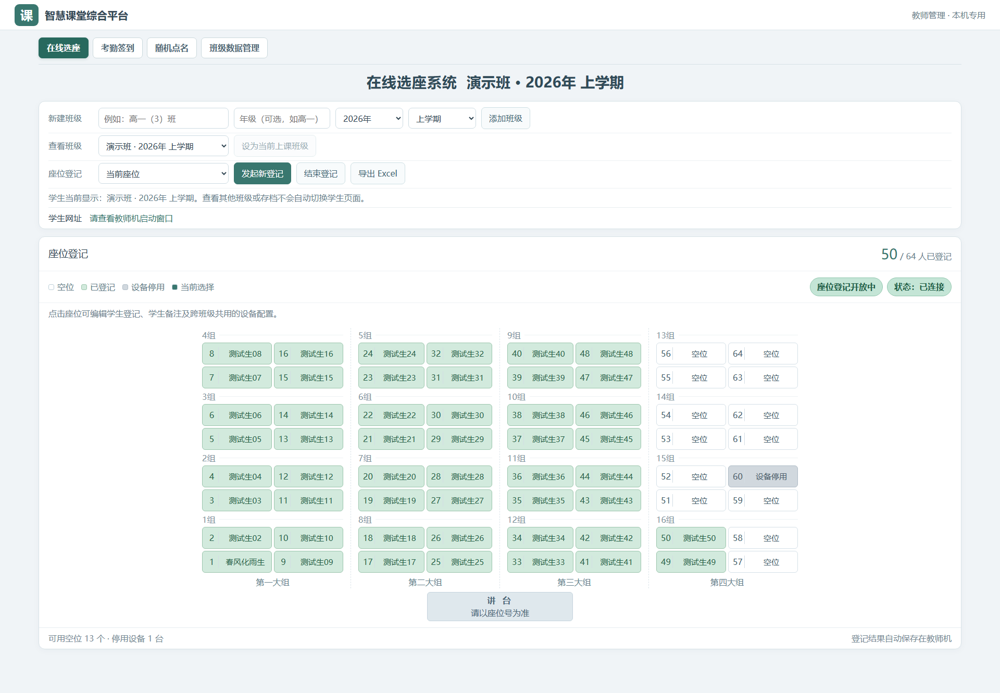
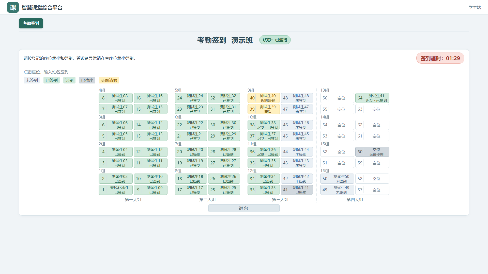
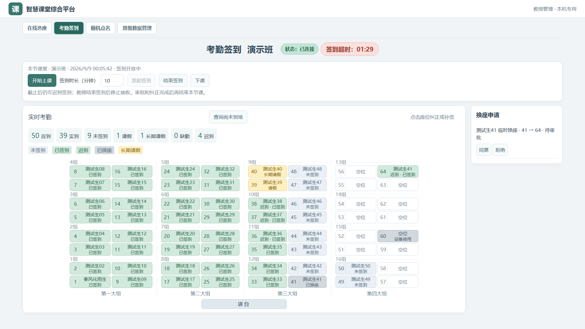
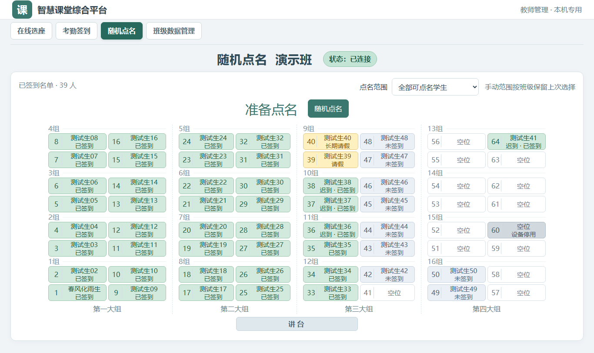
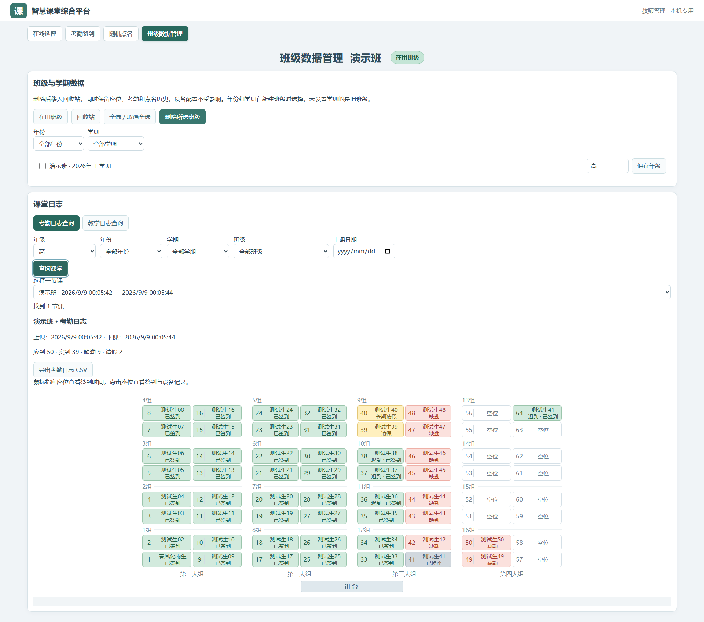

# 智慧课堂综合平台 · ClassroomAssistant

教师机运行的局域网课堂工具。学生浏览器完成选座和签到，教师管理设备、查看考勤、随机点名，按原 Excel 模板导出座位表。

**当前版本：1.6.0 · 本地部署 · 教师机 Windows 10 x64 · 学生机 Win7 Chrome / Firefox**

[私有版本下载](https://github.com/chuiyukong/classroom-assistant/releases) · [版本记录](CHANGELOG.md) · [测试指南](docs/功能测试指南.md) · [未来计划](docs/ROADMAP.md)

## 文档怎么读

| 读者 / 用途 | 唯一入口 |
|---|---|
| Kong 日常使用、向他人介绍全部功能 | 本 README（使用流程、规则、图示、排障） |
| Kong 机房测试 | [功能测试指南](docs/功能测试指南.md) |
| Kong 了解未来开发 | [路线图](docs/ROADMAP.md)，包括 AI 对话采集完整方案 |
| 后续开发者 / AI 接手 | [项目状态](docs/PROJECT_STATUS.md) → [开发维护](docs/开发维护.md) |
| 查询历史变化和验证证据 | [CHANGELOG](CHANGELOG.md) / [验收记录](docs/验收记录.md) |

旧版使用指南、独立 HTML 说明及重复功能说明已合并；无需逐份阅读。历史版本说明留在 CHANGELOG 和 Git 历史中。

## 快速开始

1. 下载 `ClassroomAssistant-v1.6.0-Win10-x64.zip`，完整解压，关闭旧程序后双击 `ClassroomAssistant.exe`。
2. 教师选座页依次为“新建班级”“查看班级并设为当前”“座位登记与导出”。新建时选择年份、上/下学期。
3. 学生使用启动窗口的局域网网址。先在一台学生机测试，再用极域统一打开；保持教师机窗口运行。
4. 第一次上课发起座位登记，学生页面自动跳到选座。完成后结束登记，导出 Excel；之后小范围调整直接点座位修改即可。
5. 日常考勤在考勤页“开始上课”，设置签到时长，再发起签到。学生点座位、输入已登记姓名，临时换座选择原因。
6. **截止后仍可签到并自动迟到。** 未签到者看“签到超时：时长”，已签到者只看“已签到”。教师点击结束签到才停止接收，剩余未签到计缺勤。
7. 教师直接点座位纠正、补签或标长期请假；右侧工具栏处理换座申请；班级数据管理中查询和导出日志。审批纠错完成后再下课，之后日志只读。
8. 随机点名随时进入，不必开始课堂。无当前考勤直接用当前座位；有当前考勤用到场名单。结果不保存，页面显示候选人数。

学生网址要使用教师机局域网 IP（例如 `http://192.168.1.10:8765/`），不能给学生发送 `localhost`、`127.0.0.1` 或教师管理地址。

## 功能流程图

座位登记通常每学期首次进行；“本节课堂”只服务于考勤快照和日志。随机点名不创建课堂、不启动签到。下节再次考勤必须新开始课堂，不能沿用上一节签到。

## 完整功能清单

| 功能 | 使用方式与实际规则 |
|---|---|
| 班级与学期 | 新建时年份、上/下学期独立保存，不拼入真实班级名；不同学期可建同名班，同行为独立数据。旧班显示未设置学期，不自动猜测，也暂无补录入口。年份可选当前年前后 10 年。 |
| 当前上课班级 | 只有设为当前或发起登记才切换学生页面；教师查看别班或存档不会切换。教师选座页显示年份学期；学生所有页面及其他课堂页只显示班级名。 |
| 班级数据筛选 | 数据管理按年份、学期筛选；可单选、全选当前筛选结果，批量移入回收站或恢复。 |
| 回收站 | 删除会关闭相关登记/课堂并保留历史，设备配置保留。恢复后重新选择上课班级，不自动开放登记。暂不支持永久销毁。 |
| 64 座布局 | 四大组、十六小组，与新版 Excel 对应；讲台方向固定。选座、签到、随机点名使用同一布局。 |
| 登记开放状态 | 绿色状态表示开放，浅红色表示未开放；连接状态为独立提示，已连接不等于允许提交。 |
| 座位冲突 | 多人同抢一个座位，只接受一个，不覆盖姓名。学生提交须收到教师机成功响应才显示成功。 |
| IP 限制 | 同次登记同来源 IP 和浏览器会话只能登记一次，切换浏览器仍受 IP 限制。没有十分钟过期；新登记重新计数。教师清除会释放占用。IP 不是身份，不能阻止改 IP 或代填姓名。 |
| 重试保护 | 同一提交重试不新增；已由教师清除的旧请求不会让误填记录复活。 |
| 同名处理 | 学生端规范化空白、全半角和大小写后同名拒绝，引导教师。教师通过独立学生记录处理同名，姓名不是编号。签到同名也由教师补签。 |
| 教师纠错 | 当前座位可改姓名、选已有学生、建立同名新学生、清除误填；学生不能自行改已登记内容。 |
| 学生备注 | 私密，绑定学生编号，随学生保留；点击座位编辑备注，独立未就座学生备注入口已移除。存档冻结备注快照。普通 Excel 和学生页面不含备注。 |
| 座位备注 | 记录设备故障，跨班级共用；仅教师可见。设备停用禁止学生登记/签到，恢复后可选。已有固定姓名保留。 |
| 当前座位/存档 | 新登记立即成为空的当前座位，不继承旧姓名；旧表只读，保留导出。后续课堂模块通过业务接口读取当前座位。 |
| Excel 导出 | 在模板副本填姓名、班级、人数，空座留空；保留其他工作表与打印设置，不覆盖原文件。 |
| 学生入口 | 未开放座位登记时默认签到页并隐藏选座导航；教师开放后自动跳转选座，结束后返回签到。没有发起签到也能看固定座位。 |
| 本节名单 | 开始课堂时冻结固定座位中已登记学生；不接受名单外姓名，之后改固定座位不改写历史快照。 |
| 签到限制 | 每节课每个学生、来源 IP、会话、实际座位各只能签到一次；重复原提交保留首次时间。教师纠正可以释放占用。 |
| 时限与迟到 | 服务端截止时间为准，截止时刻起记录迟到，迟到秒数从截止时间算起。已签到学生仅显示已签到，未签到者显示签到剩余或签到超时。倒计时到零不关闭；教师结束签到后停止常规提交。教师指定撤销为未签到的学生可在下课前重签，其他人仍禁止。旧版本已关闭签到不会自动重开。 |
| 实时座位签到 | 固定座位姓名加签到状态；实际到场座位显示签到人，原位显示已换座；长期请假状态向学生展示，私密备注和请假原因不公开。输入框不随刷新重建。 |
| 临时换座 | 可选未被本次签到占用且设备可用的座位，输入名单内姓名，选原设备故障或申请长期换座；两种换座都提交申请，临时申请不改固定座位。 |
| 换座审批 | 临时同意仅确认本节实际座位；长期同意才修改当前固定座位，学生身份和备注保留。目标已有固定学生或原位已变化时拒绝覆盖；先由教师核对调整。拒绝申请不撤销本次临时签到。 |
| 考勤状态 | 正常、迟到、未签到、请假、缺勤、长期请假。应到包含请假，实到包含正常和迟到。未开展考勤不自动认定缺勤。 |
| 长期请假 | 教师标记一次，后续课堂沿用；该学生再次成功签到自动解除。自由备注中写长期请假不会自动改变考勤。 |
| 考勤纠正 | 教师点击座位补签/改状态（空座也可选学生），签到关闭后仍可操作，下课后只读。撤销为未签到释放旧设备/座位，并只允许该学生重签；首次到场时间保留，设备换机不额外算迟到。首次教师补签按当前时刻计算，无任意补录时间。 |
| 日志查询 | 班级数据管理中按年级、年份、学期、班级和日期找到某节课；展示上下课时间、座位考勤图，悬停显示签到时间/IP，点击查看签到和纠正设备记录，导出 UTF-8 CSV。教学日志页是预留入口，尚无 AI 等学习数据。 |
| 随机点名 | 不需要开始课堂；没有当前考勤时直接用当前座位，已开展本节考勤时仅用到场名单（结束签到后仍用到场名单）。下课后恢复当前座位。显示来源和候选人数，未到座位有状态提示。 |
| 点名范围 | 全部、迟到、手动多选。点击座位添加/取消手动范围，每班仅保留上次选择，重启保留；范围与当前可点名名单取交集，不抽缺勤者。结果不保存。 |
| 点名重复与保存 | 候选超过一人时避免立即重复上一人；仅一人时明确提示。不是整轮不重复或公平轮换。新页面结果不写数据库，旧版本点名历史继续保留，可通过旧接口读取。 |
| 断线与重启 | 断线显示红色状态、禁止误提交；恢复后同步。教师机重启保留班级、座位和本节签到，但跨天须开始新课堂。 |
| 权限与本地数据 | 教师接口限本机访问，写操作验证会话和来源；数据在独立 SQLite 目录，升级自动备份。学生无需安装，无外部网页资源。 |

## 工作方式与技术架构

单程序、单数据库，模块分别维护自己的数据。点名只保存每班最后一次手动范围，不保存抽取结果；未来教学模块以 `lesson_id + student_id` 关联到本节课堂，不通过 Excel 交换数据。

### 课中换电脑和日志查询

1. 教师点击已签到学生的座位，将状态改为“未签到（撤销签到）”。
2. 学生换到设备可用的空座，重新输入姓名签到并选择换座原因；即使常规签到已结束，该学生仍能重签，其他未获指定的学生不能提交。
3. 教师处理临时/长期申请。原实际座位释放，重签设备 IP 自动记录；首次到场时间保留，最新签到时间记录换机时刻。
4. 点击“下课”冻结该节数据。到班级数据管理查询课堂，悬停座位看时间/IP，点击看设备和纠正记录。尚未到场名单在考勤页点击按钮才显示。

IP 只从实际学生请求获取；教师首次手动补签或手动换设备时无法得知学生机 IP，日志明确显示“未获取”，不会误写成教师 IP。需要设备关联时，让该学生在实际电脑重新签到。旧版本未记录的历史设备事件不会补造。

## 页面预览

以下均为虚构测试姓名。

## 状态和配色

绿色为已登记、正常/迟到已签到；开放与连接正常用更深一档绿色。蓝灰色为未签到，白色为空座，浅红色统一表示缺勤、未开放或断线，黄色表示请假和长期请假，灰色为设备停用及换座后的原位（点名页原位显示白色空位）。姓名15px常规字重、下方状态小一号；颜色旁保留文字。学生能看考勤状态，但看不到备注、IP 和纠正日志。

座位整体使用状态底色；竖线上下各留5px空白，未签到使用浅蓝灰色（#eaf0f5）。

## 常见问题

| 问题 | 处理方式 |
|---|---|
| 教师能打开，学生不能 | 确认同一局域网、正确 IP 和端口；检查 Windows 防火墙允许此程序在机房网络通信，必要时由管理员仅对学生子网开放 TCP 8765。无需关闭整个防火墙。 |
| 显示多个网址 | 无线网卡或虚拟网卡可能产生多个地址，在一台学生机逐个测试并选择可用地址。 |
| 重复登记被拦截 | 同次登记同 IP 只能一条，无十分钟冷却。填错联系教师清除或修正；新登记重新计数。 |
| 只点名同一人 | 先看候选人数；只一人签到时只能抽中此人。两人及以上不会紧接着重复上一人，但仍可能隔次重复。 |
| 长期换座审批失败 | 新座位有固定登记时不会覆盖他人；教师先核对名单并处理目标占用。临时签到成功不等于长期换座已获批。 |
| 程序/端口已在使用 | 先关闭旧实例；必要时在数据目录 settings.json 调整 port 并重启，重新发送学生网址。 |
| 名字很长 | 按最多五个汉字可完整显示设计；更长姓名仍保存，悬停座位可看全名。小屏横向滚动保留字号。 |
| Win7 页面异常 | 记录 Chrome/Firefox 版本、分辨率、操作顺序，按测试指南反馈；不能以新浏览器测试代替实机。 |

## 数据、备份和更新

在启动窗口点击“打开数据目录”；默认 `%LOCALAPPDATA%\ClassroomAssistant`。`classroom.sqlite3` 是主数据库，`config` 是日常模板配置。程序更新不覆盖数据，升级结构会自动备份。关闭程序后可复制整个数据目录，不要在运行中仅复制主数据库文件或删除 WAL/SHM 文件。

查看数据库可用 [DB Browser for SQLite](https://sqlitebrowser.org/dl/)，优先只读打开副本；日常修改通过教师界面，避免破坏身份、座位和存档关联。

平台名称已更新，程序文件名和数据目录仍叫 ClassroomAssistant，以确保旧数据继续使用。仓库保持私有，发布包不包含学生资料、数据库、密钥或运行日志。

## 版本进展

| 版本 | 日期 | 主要变化 |
|---|---|---|
| 1.6.0 | 2026-09-09 | 紧凑竖线座位图、日志集中查询、临时换座审批、指定学生重签、IP 轨迹、点名范围 |
| 1.5.0 | 2026-09-08 | 文档合并、统一平台名称和 UI、自动选座跳转、座位弹窗纠正、点名独立于课堂 |
| 1.4.0 | 2026-09-08 | 截止后迟到签到、班级年份学期、紧凑座位图、完整测试指南 |
| 1.3.0 | 2026-09-08 | 模板升级修复、座位图签到、倒计时、长期换座审批、点名高亮 |
| 1.2.0 | 2026-09-07 | 考勤、随机点名、班级回收站、新版模板 |
| 1.1.0 | 2026-09-06 | IP 限制、同名身份、设备配置和私密备注 |
| 1.0.0 | 2026-09-06 | 首版局域网选座和 Excel 导出 |

详细修复记录以 CHANGELOG 为准；开发验证与机房未测项以验收记录为准。

## 后续开发与维护

AI 对话采集、噪声检测、互动游戏、学号导入、整轮不重复公平点名等仍未实现，见路线图。新功能按模块通过公共业务接口复用学生与座位数据，不能通过 Excel 或跨模块改表交换状态。

维护者每次发布同步 README 功能表和流程图、测试指南、项目状态、验收记录与 CHANGELOG。技术接口、数据边界、构建和升级只有一份文档：docs/开发维护.md。

开发者 **Kong**
